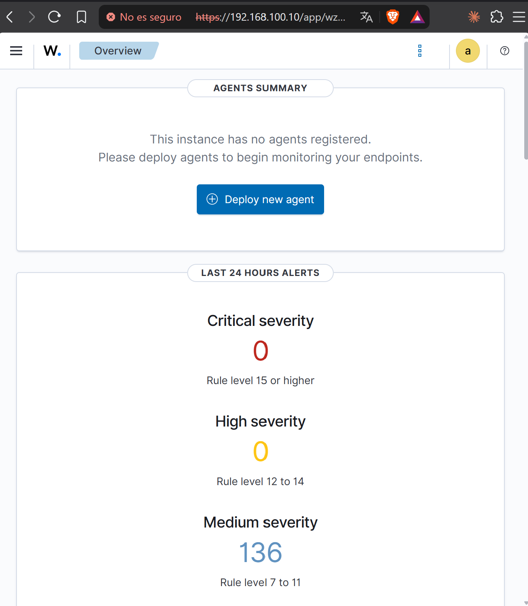

# 02 - Instalación de Wazuh

## Objetivo

Instalar la plataforma Wazuh completa (indexador, servidor y panel web) en `wazuh-server` y comprobar que el panel es accesible desde el equipo anfitrión.

## Versión y método

| Parámetro | Valor |
|---|---|
| Versión | Wazuh 4.14.8 |
| Método | Asistente de instalación oficial, modo todo en uno (`-a`) |
| Sistema | Ubuntu Server 24.04.5 LTS |
| Panel web | https://192.168.100.10 (puerto 443) |

El modo todo en uno instala en la misma máquina los tres componentes:

- **Wazuh indexer**: almacena e indexa las alertas.
- **Wazuh server (manager)**: analiza los eventos y genera las alertas. Incluye Filebeat, que envía las alertas al indexador.
- **Wazuh dashboard**: interfaz web.

## Procedimiento

1. Actualizar el sistema:

```bash
sudo apt update && sudo apt upgrade -y
```

2. Descargar el asistente de instalación de la rama 4.14:

```bash
curl -sO https://packages.wazuh.com/4.14/wazuh-install.sh
```

3. Ejecutar la instalación completa:

```bash
sudo bash ./wazuh-install.sh -a
```

El asistente genera los certificados y las contraseñas, instala los tres componentes y los arranca. Las contraseñas se guardan en `wazuh-install-files.tar`, en el directorio desde el que se lanzó el asistente.

## Verificación

- El log `/var/log/wazuh-install.log` termina con `Wazuh dashboard web application initialized` e `Installation finished`.
- El panel responde en `https://192.168.100.10`. El navegador avisa de que el certificado no es de confianza porque lo genera el propio Wazuh, algo esperado en un laboratorio.
- La pantalla **Overview** muestra `0 agents` y alertas de severidad media del propio servidor, que se vigila a sí mismo.



## Incidencias y soluciones

| Incidencia | Causa | Solución |
|---|---|---|
| La instalación del indexador tardó unos 20 minutos | Descarga lenta del paquete (cerca de 800 MB) a través de la red NAT de VMware | Medir el avance con `ls -lh /var/cache/apt/archives/partial/` y esperar |
| La instalación parecía parada sin mostrar nada | La fase `dpkg --configure` del manager no escribe en pantalla | Comprobar con `ps aux` que `apt` y `dpkg` seguían activos |
| El paquete `wazuh-dashboard` quedó en estado `iHR` (a medias) | La VM se suspendió durante su instalación | El asistente reintentó la instalación solo y terminó con éxito |

## Seguridad de las credenciales

- Las contraseñas generadas **no se guardan en el repositorio**. Se conservan fuera de él.
- Las contraseñas generadas solo sirven para este laboratorio, que está en una red aislada (VMnet10).
- Mejora prevista: cambiar la contraseña de `admin` por una propia.

## Estado de la fase

- [x] Sistema actualizado
- [x] Wazuh 4.14.8 instalado (indexador, servidor y panel)
- [x] Panel accesible desde Windows
- [ ] Instantánea `02-wazuh-instalado`
- [ ] Cambiar la contraseña de `admin`
- [ ] Instalar el agente en `victima-linux`
