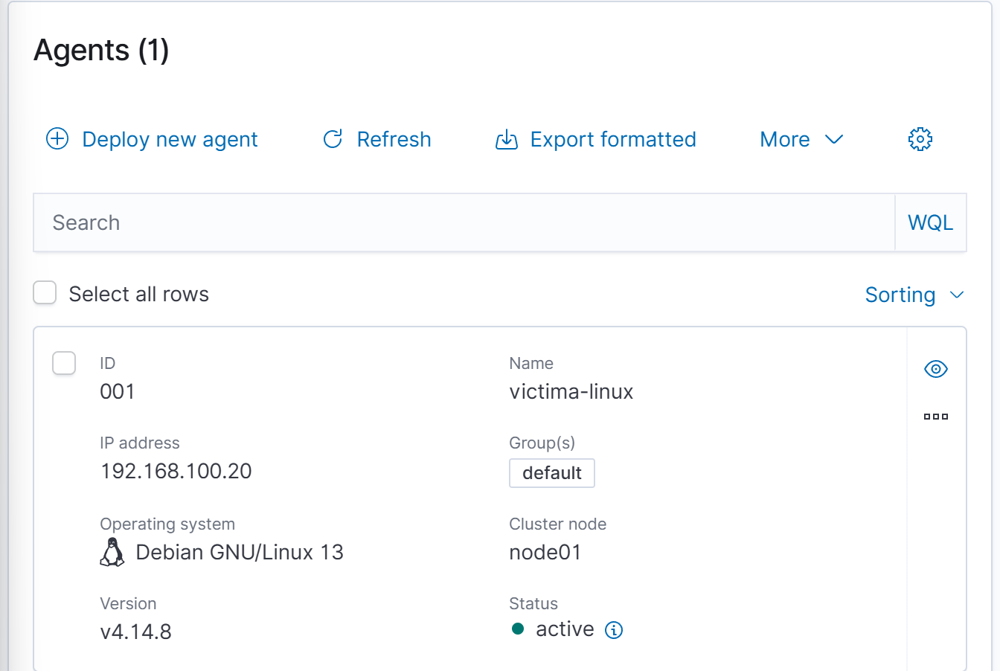
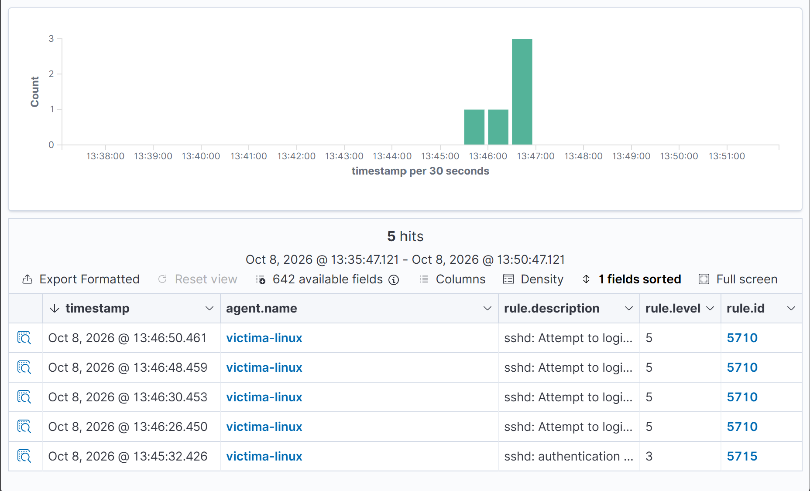
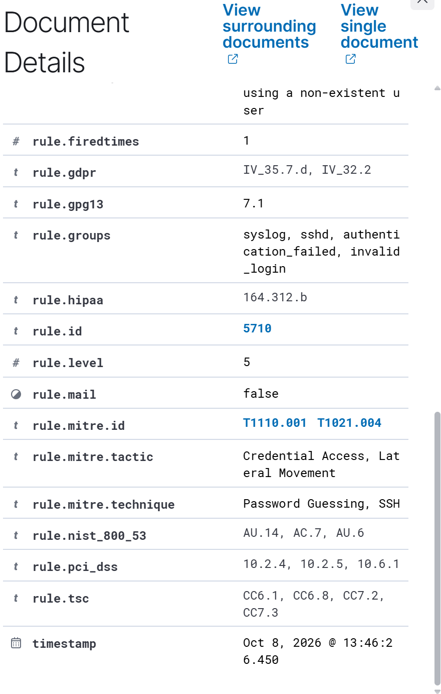

# 03 - Máquina víctima y agente Wazuh

## Objetivo

Crear la máquina `victima-linux`, conectarla a la red aislada del laboratorio, instalarle el agente de Wazuh y comprobar que sus eventos llegan al servidor y generan alertas.

## Máquina `victima-linux`

| Parámetro | Valor |
|---|---|
| Sistema | Debian GNU/Linux 13.7.0 (instalación mínima, sin entorno de escritorio) |
| Recursos | 2 vCPU, 2 GB de RAM, 20 GB de disco |
| Red 1 | VMnet10 (`ens33`), IP fija `192.168.100.20/24` |
| Red 2 | NAT (`ens34`), temporal, por DHCP |
| Software instalado | Servidor SSH y utilidades estándar del sistema |
| Usuario | `hamid`, con `sudo` |

Se eligió una instalación mínima porque un escritorio añade cientos de paquetes y servicios que generarían ruido en los logs y consumirían RAM. Con el servidor SSH instalado, la máquina se administra por consola.

### Particionado

Disco completo con una única partición ext4 y swap, sin LVM, igual que en `wazuh-server`.

## Configuración de red

Debian usa `/etc/network/interfaces` en lugar de netplan. La configuración de `ens34` (NAT, DHCP) la dejó el instalador. La tarjeta del laboratorio se añadió en un fichero aparte para no tocar la salida a internet:

`/etc/network/interfaces.d/lab`:

```
auto ens33
iface ens33 inet static
    address 192.168.100.20/24
```

Se activó con `sudo ifup ens33`. No se define puerta de enlace en `ens33`; la salida a internet sigue yendo por `ens34`.

Comprobación de conectividad con el servidor:

```bash
ping -c 4 192.168.100.10
```

Resultado: 4 paquetes enviados, 4 recibidos, 0 % de pérdida.

## Instalación del agente

El comando se generó con el asistente **Deploy new agent** del panel de Wazuh, indicando el paquete DEB amd64, la dirección del servidor `192.168.100.10` y el nombre de agente `victima-linux`:

```bash
wget https://packages.wazuh.com/4.x/apt/pool/main/w/wazuh-agent/wazuh-agent_4.14.8-1_amd64.deb && sudo WAZUH_MANAGER='192.168.100.10' WAZUH_AGENT_NAME='victima-linux' dpkg -i ./wazuh-agent_4.14.8-1_amd64.deb
```

Después se activó el servicio:

```bash
sudo systemctl daemon-reload
sudo systemctl enable --now wazuh-agent
sudo systemctl status wazuh-agent --no-pager
```

El servicio quedó `active (running)` y habilitado para arrancar con el sistema.

En el panel, el agente aparece con ID `001`, IP `192.168.100.20`, sistema Debian GNU/Linux 13, versión 4.14.8 y estado **active**:



## Primera detección: intentos de login SSH fallidos

Para comprobar que el flujo completo funciona (log del sistema, agente, servidor, alerta) se hicieron tres intentos de acceso SSH con un usuario inexistente desde el equipo anfitrión:

```bash
ssh usuarioinventado@192.168.100.20
```

Wazuh generó alertas en pocos segundos. Se filtraron en **Threat Hunting → Events** con:

```
agent.name:"victima-linux" and rule.groups:"sshd"
```



| Alertas | Regla | Nivel | Descripción |
|---|---|---|---|
| 4 | 5710 | 5 | `sshd: Attempt to login using a non-existent user` |
| 1 | 5715 | 3 | `sshd: authentication success` (acceso normal de `hamid`) |

Detalle de la regla 5710:

| Campo | Valor |
|---|---|
| Grupos | `syslog`, `sshd`, `authentication_failed`, `invalid_login` |
| MITRE ATT&CK | T1110.001 (Password Guessing) y T1021.004 (SSH) |
| Tácticas | Credential Access, Lateral Movement |



## Incidencias y soluciones

| Incidencia | Causa | Solución |
|---|---|---|
| Se instaló un escritorio sin quererlo | Se pulsó Siguiente en la selección de software sin revisarla; Debian marca GNOME por defecto | Se apagó la VM y se repitió la instalación, desmarcando el escritorio y marcando solo el servidor SSH y las utilidades estándar |
| La VM se quedaba en negro al reiniciar el instalador | El orden de arranque de la BIOS ponía el disco duro antes que el CD-ROM, y el disco tenía una instalación a medias | Se cambió el orden de arranque en la BIOS (Boot) para que el CD-ROM fuera primero; se guardó con la opción Exit Saving Changes |
| Las teclas `+` y `F10` no respondían en la BIOS | La BIOS interpreta el teclado como inglés | Se bajó el disco duro con la tecla `-` y se guardó desde la pestaña Exit |
| `sudo` no estaba instalado | Al definir contraseña de root, Debian no instala `sudo` ni da permisos al usuario | Con `su -`: `apt install -y sudo` y `usermod -aG sudo hamid`; se cerró sesión y se volvió a entrar |

## Estado de la fase

- [x] `victima-linux` instalada (Debian 13.7.0 mínima) con SSH y `sudo`
- [x] IP fija `192.168.100.20` en VMnet10
- [x] Agente Wazuh 4.14.8 instalado y activo
- [x] Primera detección verificada (regla 5710, MITRE T1110.001)
- [ ] Instantánea `02-agente-wazuh-activo`
- [ ] Máquina `atacante` (Kali Linux)
