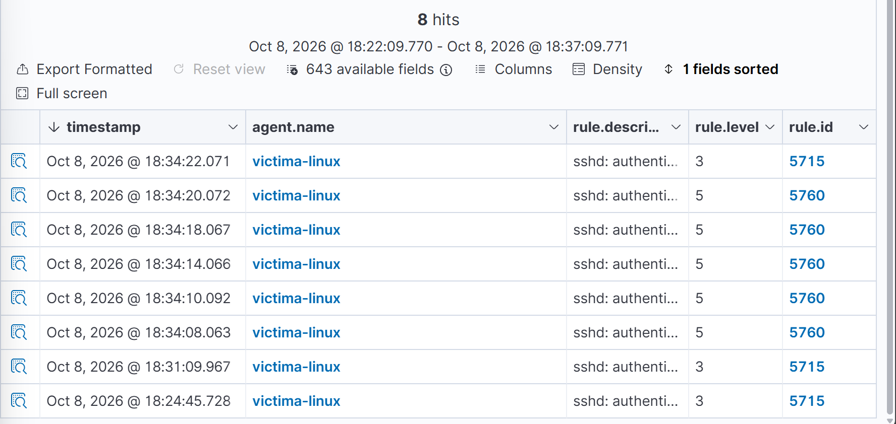
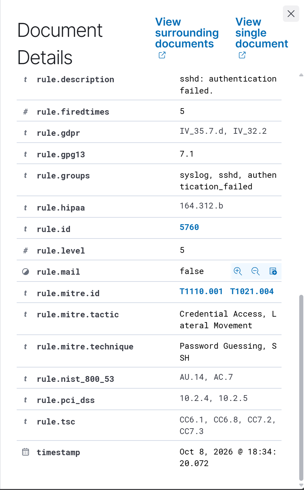

# 05 - Ataque: fuerza bruta SSH con Hydra

## Objetivo

Lanzar un ataque de fuerza bruta contra el servicio SSH de `victima-linux` desde `atacante`, y comprobar qué detecta Wazuh por defecto, sin reglas personalizadas.

## Aislamiento del laboratorio

Antes de atacar, se desconectó la tarjeta NAT (temporal) de `atacante` y `victima-linux` en VMware, dejando únicamente la red `VMnet10`. Se comprobó que ninguna de las dos máquinas tiene salida a internet:

```bash
# En victima-linux
ping -c 2 8.8.8.8
# ping: connect: La red es inaccesible
```

Se confirmó que las máquinas seguían comunicándose entre sí por la red del laboratorio:

```bash
# En atacante
ping -c 3 192.168.100.20
# 3 packets transmitted, 3 received, 0% packet loss
```

## Herramienta y preparación

Se usó **Hydra**, una herramienta de fuerza bruta contra servicios de red (SSH, FTP, HTTP, etc.). Se preparó una lista corta de contraseñas (`~/passwords.txt`) en `atacante`, con 5 contraseñas comunes y, en último lugar, la contraseña real de laboratorio del usuario `hamid` en `victima-linux`, para observar tanto los fallos como el acceso conseguido.

## Ataque

```bash
hydra -l hamid -P ~/passwords.txt ssh://192.168.100.20 -t 1 -V
```

- `-l hamid`: usuario objetivo (existente en la víctima).
- `-P ~/passwords.txt`: lista de contraseñas a probar.
- `-t 1`: una conexión a la vez, para separar bien los eventos en los logs.
- `-V`: muestra cada intento en pantalla.

Resultado: Hydra probó las 6 contraseñas en 17 segundos y encontró la válida en el último intento:

```
[22][ssh] host: 192.168.100.20   login: hamid   password: victima
1 of 1 target successfully completed, 1 valid password found
```

## Detección en Wazuh

Se filtraron los eventos en **Threat Hunting → Events** con:

```
agent.name:"victima-linux" and rule.groups:"sshd"
```



| Alertas | Regla | Nivel | Descripción |
|---|---|---|---|
| 5 | 5760 | 5 | `sshd: authentication failed.` (usuario válido, contraseña incorrecta) |
| 1 | 5715 | 3 | `sshd: authentication success` (acceso logrado con la última contraseña) |

Detalle de la regla 5760:

| Campo | Valor |
|---|---|
| Grupos | `syslog`, `sshd`, `authentication_failed` |
| MITRE ATT&CK | T1110.001 (Password Guessing) y T1021.004 (SSH) |
| Tácticas | Credential Access, Lateral Movement |



La regla 5760 (contraseña incorrecta, usuario existente) es distinta de la regla 5710 vista en la Fase 3 (usuario inexistente), aunque ambas se clasifican bajo las mismas técnicas MITRE.

## Hallazgo clave

Con 5 intentos fallidos seguidos en 14 segundos, un patrón claro de fuerza bruta, Wazuh generó **5 alertas individuales de nivel 5**, cada una tratada por separado. **No se disparó ninguna regla de correlación de fuerza bruta** (no hay alerta de nivel superior indicando "múltiples fallos de autenticación"), y **no se bloqueó la IP del atacante** en ningún momento: el sexto intento, con la contraseña correcta, tuvo éxito sin ningún obstáculo.

Esto no es un fallo de Wazuh, sino el comportamiento esperado de su configuración por defecto: detecta y registra cada evento, pero la correlación de fuerza bruta y la respuesta automática (active response) hay que configurarlas explícitamente. Es el objetivo de la siguiente fase.

## Estado de la fase

- [x] Laboratorio aislado (NAT desconectada) y conectividad interna verificada
- [x] Ataque de fuerza bruta SSH ejecutado con Hydra
- [x] Alertas de nivel 5 (regla 5760) identificadas y mapeadas a MITRE ATT&CK
- [x] Confirmado que no hay correlación de fuerza bruta ni bloqueo automático por defecto
- [ ] Instantáneas de `atacante` y `victima-linux` tras el ataque
- [ ] Regla personalizada de correlación y active response (Fase 6)
